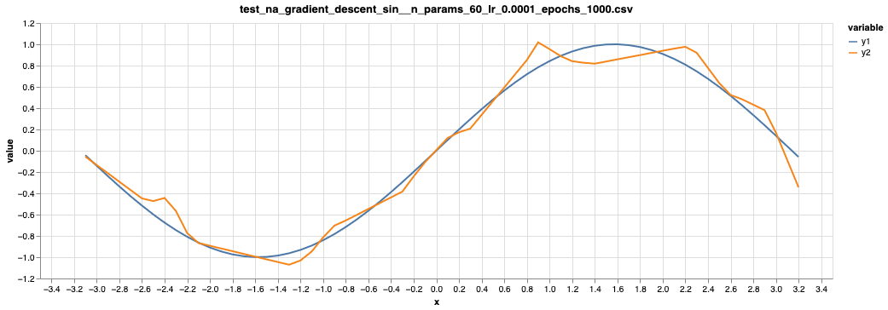

# Automatic gradient in Rust

A learning exercise to understand automatic gradient, and to exercise Rust. The intention is to have a fully working minimal autograd library that will be able to do automatic differentiation and training.

## Learnings, observations

- Computation graph can be agnostic to the underlying representation of the value (if e.g. it is f32 or int).
- `From` tuple to Composite simplifies syntax
- Rust forces you to separate the concepts, like expression builder from computation, otherwise the problem becomes to
  entangled. When separated, the problems can be nicely implemented.
- You can have optional arguments in a function with `&[Opts]`, where `Opts` is an enum.
- Fitting parameters of a polynomial with a gradient descent is hard, possibly (my naive interpretation) because small
  changes in the parameters can cause a large change at the output.
- Vector operations with `nalgebra` are (unsurprisingly) orders of magnitude faster than a primitive loop.
- Rust type system starts when it comes to refactoring. If it compiles, it means that the refactoring is done.

## Materials

### Automatic gradient

- [Hugging Face: What's Automatic Differentiation?](https://huggingface.co/blog/andmholm/what-is-automatic-differentiation)
- [YT: What is Automatic Differentiation?](https://www.youtube.com/watch?v=wG_nF1awSSY)
- [Demystifying AutoGrad in Machine Learning](https://medium.com/@weidagang/demystifying-autograd-in-machine-learning-eb7d5c875ff2)
- [Max pooling and back-propagation](https://datascience.stackexchange.com/a/11703)

### CNN

- [Developing a simple CNN for MNIST](https://medium.com/@jaredmcmullen1/developing-a-simple-cnn-for-mnist-f98c38f0d38d) - 7 layers
- [MNIST: Keras Simple CNN (99.6%)](https://medium.com/@BrendanArtley/mnist-keras-simple-cnn-99-6-731b624aee7f) - 20 layers
- [Understanding the Convolutional Filter Operation in CNN’s.](https://medium.com/advanced-deep-learning/cnn-operation-with-2-kernels-resulting-in-2-feature-mapsunderstanding-the-convolutional-filter-c4aad26cf32)

## Using [marimo][ref_marimo] to view test outputs

There are integration tests that compare a function and that function re-created using derivatives. If the test fails,
then a CSV file is created showing the difference. You can view the files with [marimo][ref_marimo] notebook:

```bash
make marimo
```

[ref_marimo]: https://marimo.io/

# How does it go?

## Fitting sin curve

30 ReLU curves quite fit a sin function (in [test_na_gradient_descent.rs](tests/test_na_gradient_descent.rs)):



# Possible TODOs

- Allow setting initial parameter values in expression tree, so it's possible to create implicit parameters. like `eb.new_unnamed_parameter(Some("p0"), || rand())`
- Implicit parameters in CNN, like in 32 filters.
- Implement operations on tensors (not only 2d arrays) to support CNN.
- Figure that `(a-b)*(a-b)` are the same nodes, not two different ones. To do that, use hash of node, instead of incremental id.
- Train CNN recognizing single letter (like R letter).
  - Implement conv2d operation. This requires implementing tensors (3d at least). Should switch to narray?
- Train on multiple CPUs at once
- Train on GPU
